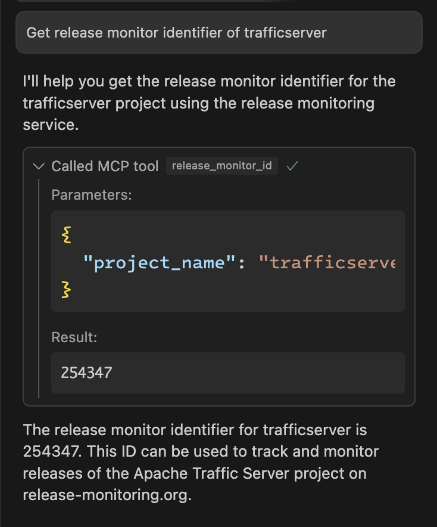

# Release Monitor ID Tool

A [hyper-mcp](https://github.com/tuananh/hyper-mcp) plugin that retrieves project ID from release-monitoring.org.

<p align="center">
  
</p>

## Usage

The tool accepts a single parameter:
- `project_name`: The name of the project to search for

Example response:
- If found: Returns the project ID as a string
- If not found: Returns "No projects found"

Add the plugin to your hyper-mcp configuration:
```json
{
  "plugins": [
    {
      "name": "release-monitor-id",
      "path": "oci://ghcr.io/ntheanh201/release-monitor-id-plugin:latest",
      "runtime_config": {
        "allowed_hosts": ["release-monitoring.org"]
      }
    }
  ]
}
```